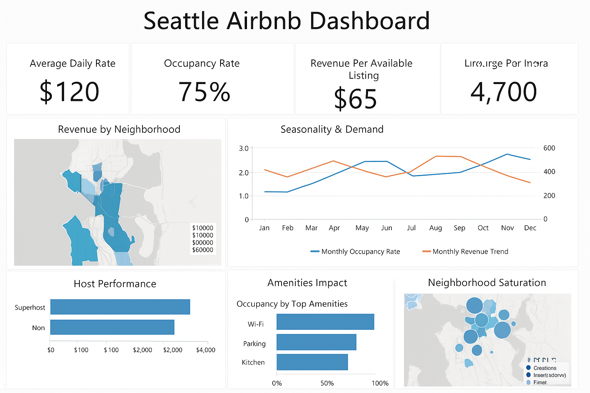

# 🏠 Seattle Airbnb Data Analysis
## 📌 Problem Statement

Seattle’s short-term rental market through Airbnb has expanded rapidly, providing travelers with diverse accommodation options and hosts with business opportunities. However, stakeholders face several challenges:
- Determining optimal pricing strategies across neighborhoods and seasons.

- Understanding the impact of host type, reviews, and amenities on occupancy and revenue.

- Identifying neighborhoods that are oversaturated versus those with growth opportunities.

- Assessing how seasonality and customer preferences shape market demand.
This project uses the **Seattle Airbnb Open Data** to uncover actionable insights that address these challenges and support data-driven decision-making for stakeholders.
## 🎯 Project Objectives

**1.Pricing & Revenue Optimization**

- Analyze how average daily rates (ADR) and occupancy vary across Seattle neighborhoods.

- Identify optimal pricing strategies that maximize host revenue.

**2.Seasonality & Demand Forecasting**

- Examine seasonal trends in bookings and revenue.

- Identify peak and off-peak periods influencing pricing and availability.

**3.Host Performance & Superhost Advantage**

- Investigate whether Superhosts and multi-property hosts achieve higher occupancy and revenue.

- Compare performance between new and established listings.

**4.Impact of Reviews & Amenities on Bookings**

- Assess how review ratings affect occupancy and price premiums.

- Determine which amenities (Wi-Fi, parking, kitchen, pet-friendly, etc.) drive higher demand.

**5.Neighborhood Saturation & Market Opportunities**

- Evaluate which neighborhoods are oversaturated with listings.

- Identify high-demand areas offering growth opportunities for new hosts.
## 📊 Expected Outcomes

- Insights into optimal pricing strategies tailored by neighborhood and season.

- Recommendations on host strategies (Superhost status, property types, amenities).

- A data-driven understanding of demand patterns in the Seattle Airbnb market.

- Identification of neighborhood-level risks and opportunities for investors and hosts.
## 📂 Dataset Description

The project uses the **Seattle Airbnb Open Data** available on Kaggle
 and includes:

- **Listings.csv** → Property details (price, location, property type, amenities, host info).

- **Calendar.csv** → Daily availability, pricing, and bookings per listing.

- **Reviews.csv** → Guest reviews with ratings and comments.
## 🛠 Tools & Methods

- **Data Cleaning & Preparation** → Python (Pandas, NumPy).

- **Exploratory Data Analysis (EDA)** → Matplotlib, Seaborn, Plotly.

- **Statistical Analysis** → Correlation, regression, significance testing.

- **Visualization & Dashboards** → Power BI / Tableau for interactive insights.

- **Data Modeling** → Forecasting seasonal demand using time series models.
## 🔎 Business Problem, Analytical Approach & Expected Insights
| **Business Problem**                                                 | **Analytical Approach**                                                                                                | **Expected Insights**                                                               |
| -------------------------------------------------------------------- | ---------------------------------------------------------------------------------------------------------------------- | ----------------------------------------------------------------------------------- |
| How do prices and occupancy vary across Seattle neighborhoods?       | Group listings by neighborhood; calculate average daily rate (ADR) & occupancy using *listings.csv* and *calendar.csv* | Identify high-revenue neighborhoods and underperforming areas for hosts.            |
| How do seasonal patterns affect demand and revenue?                  | Time series analysis of bookings and prices using *calendar.csv*                                                       | Peak and off-peak months for strategic pricing and marketing.                       |
| Do Superhosts and multi-property hosts perform better?               | Compare revenue, occupancy, and reviews for Superhosts vs. non-Superhosts                                              | Quantify Superhost advantage and multi-listing profitability.                       |
| Which amenities most influence higher occupancy and pricing?         | Correlation & regression analysis between amenities and occupancy/pricing                                              | Recommendations on key amenities (e.g., Wi-Fi, parking, kitchen) that boost demand. |
| Which neighborhoods are oversaturated, and where is growth possible? | Mapping density of listings per neighborhood; compare supply vs. occupancy rates                                       | Detect oversupplied areas vs. underserved high-demand markets.                      |

## 📊 Key Performance Indicators (KPIs) for Seattle Airbnb Project
**1. Revenue & Pricing KPIs**

- **Average Daily Rate (ADR)** = Mean listing price per night.

- **Occupancy Rate (%)** = (Booked nights ÷ Available nights) × 100.

- **Revenue per Available Listing (RevPAL)** = Total revenue ÷ Total available listings.

- **Revenue Growth (%)** = Revenue comparison across months/seasons.

**2. Demand & Seasonality KPIs**

- **Monthly Booking Volume** = Total bookings per month.

- **Seasonal Occupancy Index** = Occupancy variation across seasons (peak vs. off-peak).

- **Booking Lead Time (days)** = Avg. days between booking date & check-in.

**3. Host Performance KPIs**

- **Superhost Occupancy Premium (%)** = % difference in occupancy between Superhosts and non-Superhosts.

- **Average Revenue per Host** = Total host revenue ÷ Number of hosts.

- **Multi-listing Host Share (%)** = % of listings operated by multi-property hosts.

**4. Customer Experience KPIs**

- **Average Review Score** = Mean review rating per listing.

- **Impact of Reviews on Price (%)** = % price difference between listings with high reviews (≥4.8) vs. lower reviews.

- **Response Rate of Hosts (%)** = % of hosts with high responsiveness (from dataset host fields).

**5. Market & Location KPIs**

- **Top 5 Neighborhoods by Revenue** = Ranking based on total revenue.

- **Neighborhood Saturation Index** = Listings density (listings per sq. mile) vs. occupancy.

- **Price Competitiveness Index** = Comparison of Airbnb ADR vs. hotel average rates (external data if added).
## 🖥️ Seattle Airbnb Power BI Dashboard Layout
**1️⃣ Executive Summary (Top KPIs in Cards)**

- **Average Daily Rate (ADR) 💵**

- **Occupancy Rate (%) 🏠**

- **Revenue per Available Listing (RevPAL) 📊**

- **Average Review Score (⭐)**

- **Total Listings & Active Hosts 👤**

**2️⃣ Revenue & Pricing Insights**

- **Bar/Column Chart** → Average Price by Neighborhood.

- **Line Chart** → Revenue Trend by Month (seasonality).

- **Scatter Plot** → Price vs. Review Score (shows if higher-rated listings charge more).

- **KPI Card** → Revenue Growth % (month-over-month).

**3️⃣ Host Performance Analysis**

- **Bar Chart** → Revenue comparison (Superhost vs. Non-Superhost).

- **Donut Chart** → Multi-listing Hosts (%) vs. Single-property Hosts.

- **Bar Chart** → Avg. Occupancy per Host Type (Superhost vs. others).

- **KPI Card** → Superhost Occupancy Premium %.

**4️⃣ Customer Experience & Reviews**

- **Stacked Bar Chart** → Distribution of Review Scores.

- **Bar Chart** → Top 10 Hosts by Number of Reviews.

- **Word Cloud / Treemap** → Frequent keywords in reviews (if you preprocess text in Python).

- **KPI Card** → Impact of Reviews on Price (%).

**5️⃣ Neighborhood & Market Opportunities**

- **Map Visualization (Heatmap)** → Listings Density & Revenue by Neighborhood.

- **Bar Chart** → Top 5 Neighborhoods by Revenue.

- **Heatmap Table** → Neighborhood Saturation Index (listings per sq. mile vs. occupancy).

- **KPI Card** → Neighborhood with Highest Growth Potential.

**6️⃣ Seasonality & Demand Trends**

- **Line Chart** → Monthly Occupancy Rate Trend.

- **Area Chart** → Booking Volume by Month.

- **Bar Chart** → ADR Variation by Season (Winter, Spring, Summer, Fall).

- **KPI Card** → Peak Month Occupancy %.

Here are key insights based on the Seattle Airbnb dashboard
1. Overall Market Performance

- **Average Daily Rate (ADR): $120** → Reasonable compared to hotel alternatives in Seattle.

- **Occupancy Rate: 75%** → Indicates strong demand, with most listings booked regularly.

- **Revenue Per Available Listing (RevPAL): $65** → Healthy revenue flow, though optimization is possible.

- **Listings: ~4,700** → High supply across Seattle, suggesting a competitive market.

2. Neighborhood Insights

- Some **neighborhoods significantly outperform others** in revenue, shown by darker zones on the map.

- Central areas (closer to downtown & attractions) **show higher ADR and occupancy**, making them prime investment zones.

- Outlying neighborhoods have lower revenue potential, possibly due to distance from tourist hubs.

3. Seasonality & Demand

- **Occupancy and revenue peak in summer months (May–August)** → driven by tourism season.

- **Winter months show dips** → hosts may need to reduce prices or offer discounts to maintain occupancy.

Dynamic pricing strategies can maximize revenue during peak while minimizing vacancy in off-peak.

4. Host Performance

- **Superhosts outperform non-Superhosts** in both revenue and occupancy.

- Non-Superhosts earn less, highlighting the importance of gaining Superhost status (higher trust & visibility).

- Multi-listing hosts likely benefit from economies of scale, but saturation could affect margins.

5. Amenities Impact

- **Wi-Fi has the strongest link to higher occupancy** (almost essential for bookings).

- **Parking and kitchen availability** also contribute positively, though less than Wi-Fi.

- Hosts without these amenities are at a disadvantage compared to competitors.

6. Market Saturation

- Some **neighborhoods are oversupplied** with listings but don’t show strong occupancy (shown by larger bubbles).

- **Growth opportunities exist in underserved areas** with lower density but higher demand.

- Investors should avoid oversaturated markets and focus on emerging, high-demand zones.

## 👤 Author
**Bahre Hailemariam**  
📍 _Data Analyst & BI Developer_  
📩 [Email Adress](bahre.hail@gmail.com) | 🌐[Portfolio](https://bahre-hailemariam-data-analyst.crd.co/) | 💼[LinkedIn](https://www.linkedin.com/in/bahre-hailemariam/) | 📊[GitHub](https://github.com/BahreHailemariam)
